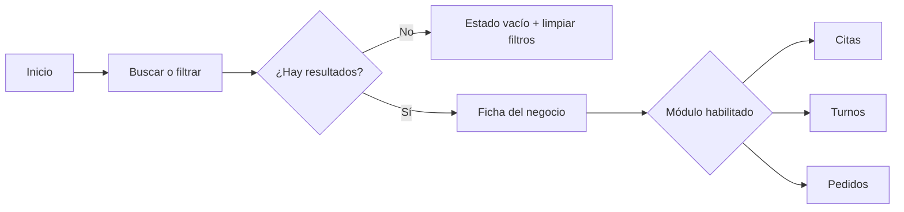
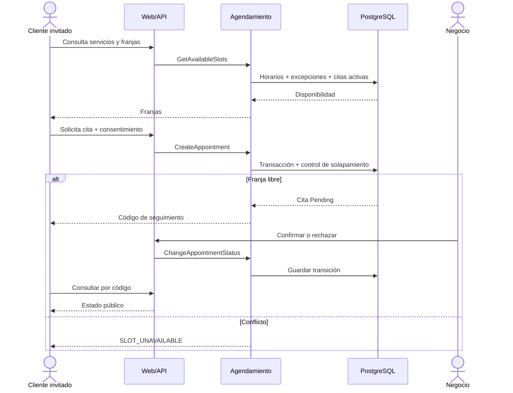
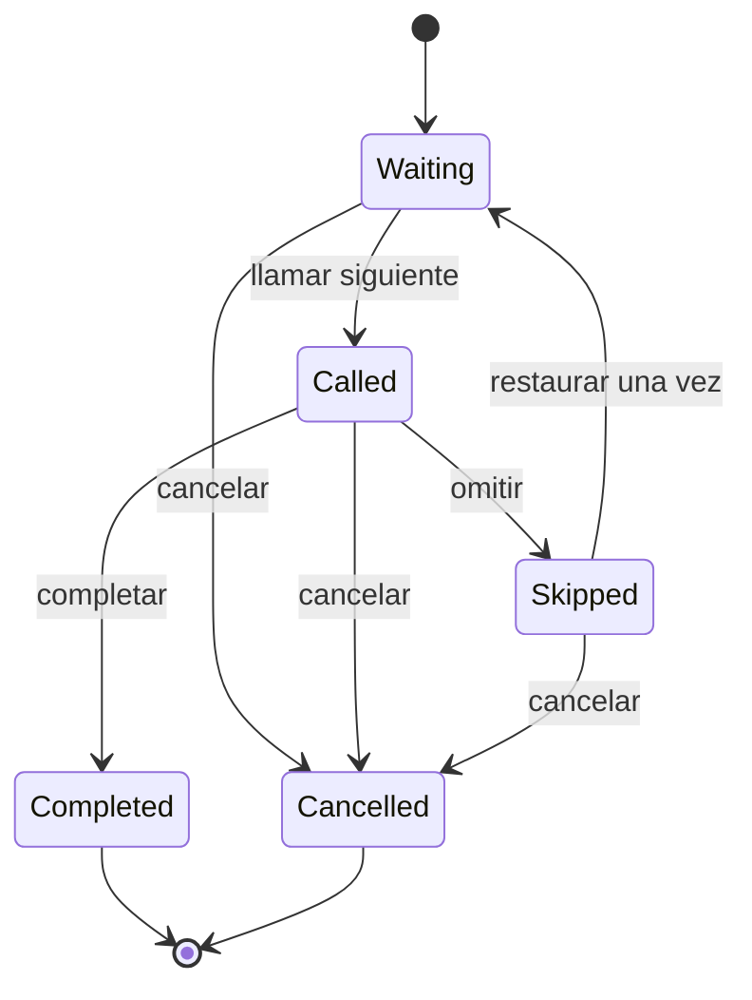
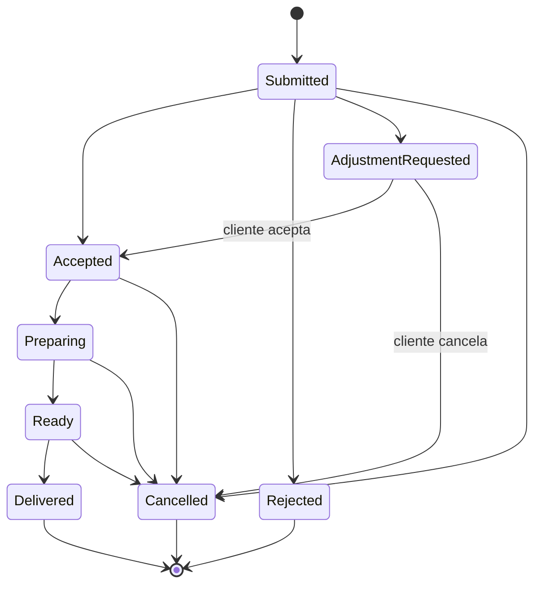

# UrabaConecta — Flujos de usuario

## 1. Convenciones

- El cliente público no crea cuenta.
- “Código” significa un token aleatorio no predecible entregado una sola vez y usado para seguimiento.
- Las fechas se muestran en la zona horaria del negocio; el servidor persiste instantes en UTC.
- Toda acción confirma resultado en lenguaje cotidiano.
- Un error de concurrencia ofrece recargar o elegir otra opción; nunca muestra detalles técnicos.
- Los estados internos se traducen a etiquetas públicas simples.

## 2. Exploración pública

1. El visitante abre `/`.
2. Ve buscador, selector de municipio y categorías.
3. Puede buscar por nombre, categoría o texto normalizado.
4. El sistema muestra solo negocios activos y publicados.
5. Si no hay resultados, muestra “No encontramos negocios con estos filtros” y acciones para limpiar filtros.
6. El visitante abre `/negocios/{slug}`.
7. Ve nombre, categoría, municipio, dirección textual, horario, teléfono público y módulos habilitados.
8. Selecciona “Agendar”, “Tomar turno” o “Pedir para recoger”.

### Errores

- Negocio inexistente, suspendido o no publicado: 404 pública.
- Módulo deshabilitado: ficha visible sin botón; URL directa responde 404.
- Falla temporal: mensaje general y botón “Intentar de nuevo”.

## 3. Cita

### 3.1 Cliente invitado

1. Abre la ficha de Salón Bella Urabá.
2. Selecciona un servicio activo.
3. Elige fecha dentro del horizonte configurado.
4. Consulta franjas disponibles.
5. El sistema asigna internamente un trabajador elegible; el MVP no obliga a elegirlo.
6. Selecciona una hora.
7. Ingresa alias o nombre y teléfono.
8. Lee y acepta el aviso de tratamiento de datos vigente.
9. Envía.
10. El servidor vuelve a comprobar disponibilidad en una transacción.
11. Si el espacio sigue libre, crea la cita `Pending`, registra consentimiento y entrega el código.
12. Si el espacio fue tomado, informa “Ese horario acaba de ocuparse” y devuelve a franjas.
13. El cliente guarda o copia el código y consulta `/seguimiento/citas/{codigo}`.
14. Ve estado, negocio, servicio, fecha y hora; el teléfono se muestra enmascarado.
15. Si está pendiente o confirmada y la política lo permite, puede cancelar.

### 3.2 Negocio

1. Un usuario autenticado abre `/panel/{businessId}/citas`.
2. La autorización confirma membresía y permiso `Appointments.Manage`.
3. Ve citas del negocio, agrupadas por fecha y estado.
4. Abre una cita pendiente.
5. Confirma o rechaza con motivo opcional breve.
6. Una cita confirmada puede pasar a completada, ausente o cancelada.
7. Cada transición queda auditada.

### 3.3 Estados y reglas

`Pending → Confirmed | Rejected | Cancelled`  
`Confirmed → Completed | NoShow | Cancelled`

- Estados terminales: `Rejected`, `Completed`, `NoShow`, `Cancelled`.
- No se puede reabrir una cita terminal.
- `Pending` y `Confirmed` bloquean solapamientos.
- La duración se copia desde el servicio al crear la cita.
- La asignación de trabajador se hace antes de persistir.
- Dos solicitudes concurrentes para el mismo trabajador y franja: solo una gana.

### Estados vacíos y errores

- Sin servicios: “Este negocio aún no publicó servicios”.
- Sin disponibilidad: ofrecer otra fecha.
- Consentimiento no aceptado: no enviar.
- Teléfono inválido: indicar formato sin revelar reglas internas.
- Código incorrecto: misma respuesta genérica que un código inexistente.

## 4. Turno virtual

### 4.1 Cliente invitado

1. Abre Barbería El Corte.
2. Ve si la cola está abierta, turno actual y espera aproximada no garantizada.
3. Si está abierta, toca “Tomar turno”.
4. No se solicita nombre ni teléfono.
5. El servidor asigna el siguiente número del día local.
6. El cliente recibe número y código.
7. La página de seguimiento muestra turno actual y cantidad de turnos activos por delante.
8. SignalR actualiza el estado.
9. Tras una reconexión, la página consulta el estado por HTTP para no depender de mensajes perdidos.

### 4.2 Trabajador

1. Abre `/panel/{businessId}/turnos`.
2. Abre la cola indicando hora de cierre opcional.
3. Toca “Llamar siguiente”.
4. El sistema elige el turno `Waiting` más antiguo, lo marca `Called` y publica el evento.
5. Puede completar, omitir o cancelar el turno llamado.
6. Un turno omitido no vuelve automáticamente; el trabajador puede restaurarlo a espera una sola vez.
7. Cierra la cola para impedir nuevas solicitudes; los turnos existentes permanecen gestionables.

### Concurrencia y errores

- El contador es único por `BusinessId + LocalDate`.
- “Llamar siguiente” usa transacción y bloqueo/concurrencia; dos trabajadores no llaman dos veces el mismo turno.
- Cola cerrada: `QUEUE_CLOSED`.
- No hay pendientes: botón deshabilitado y estado vacío.
- SignalR indisponible: banner “Actualización pausada” y refresco manual/HTTP.

## 5. Pedido para recoger

### 5.1 Cliente invitado

1. Abre Restaurante Sazón Local.
2. Consulta categorías y productos disponibles.
3. Agrega productos y cantidades; cantidad permitida: 1 a 20 por línea.
4. Agrega observaciones opcionales, máximo 300 caracteres.
5. Selecciona una franja de recogida publicada.
6. Ingresa alias o nombre y teléfono.
7. Acepta el aviso de tratamiento.
8. Revisa resumen: productos, cantidades y total.
9. Envía sin pagar.
10. El servidor valida disponibilidad y precios vigentes.
11. Calcula el total, copia nombre y precio unitario de cada producto y guarda el pedido.
12. Entrega el código de seguimiento.
13. El cliente consulta el estado.
14. Si el restaurante solicita ajuste, ve mensaje y nueva franja propuesta.
15. Puede aceptar el ajuste o cancelar el pedido.

### 5.2 Restaurante

1. Abre `/panel/{businessId}/pedidos`.
2. Ve pedidos nuevos.
3. Acepta, rechaza o solicita ajuste.
4. Si acepta, puede marcar “En preparación”.
5. Luego marca “Listo para recoger”.
6. Al entregar y cobrar en el local, marca “Entregado”.

### Reglas y errores

- El precio del pedido se toma exclusivamente del servidor.
- Si un precio o disponibilidad cambió desde que se mostró el carrito, la respuesta `CATALOG_CHANGED` devuelve el carrito recalculado para confirmación; no crea pedido silenciosamente.
- Un pedido vacío es inválido.
- El total es suma de instantáneas; cambiar o borrar el producto no altera pedidos previos.
- No hay pago, estado de pago ni datos bancarios.
- Producto agotado: se retira de nuevas solicitudes, no de pedidos históricos.
- Franja llena o cerrada: `PICKUP_SLOT_UNAVAILABLE`.

## 6. Administración del negocio

1. El usuario inicia sesión.
2. Ve únicamente negocios con membresía activa.
3. Selecciona uno; la URL siempre incluye `businessId`.
4. El propietario gestiona perfil, publicación, trabajadores, permisos, horarios y módulos.
5. Un trabajador solo ve operaciones para las que tiene permiso.
6. Cada comando vuelve a validar membresía; el selector visual no es un control de seguridad.
7. Si intenta cambiar el `businessId` de la URL, recibe 404 para recursos ajenos y el intento se registra sin PII.

### Estados vacíos

- sin negocios asignados: explicar que un administrador debe asignarlo;
- sin operaciones: mostrar acción correspondiente, no una tabla vacía;
- módulo deshabilitado: ocultar navegación y bloquear URL;
- sin servicios/productos: invitar a crear el primero.

## 7. Administración de plataforma

1. El administrador inicia sesión con rol de plataforma.
2. Gestiona municipios y categorías.
3. Crea un negocio, asigna slug único y primer propietario.
4. Activa, suspende, publica o despublica.
5. Puede consultar todos los negocios mediante casos de uso exclusivos de plataforma.
6. El acceso transversal usa endpoints separados, nunca desactiva silenciosamente el filtro del panel de negocio.
7. Las acciones quedan auditadas.

## 8. Cancelaciones

| Flujo | Quién | Permitida en | Resultado |
|---|---|---|---|
| Cita | Cliente con código | Pending, Confirmed | `Cancelled` |
| Cita | Negocio | Pending, Confirmed | `Rejected` o `Cancelled` según motivo |
| Turno | Cliente con código | Waiting | `Cancelled` |
| Turno | Trabajador | Waiting, Called, Skipped | `Cancelled` |
| Pedido | Cliente con código | Submitted, AdjustmentRequested | `Cancelled` |
| Pedido | Negocio | Submitted, Accepted, Preparing, Ready | `Cancelled`; motivo obligatorio después de aceptar |

No se borran operaciones para representar cancelación.

## 9. Mensajes de error comunes

| Código | Mensaje público |
|---|---|
| `VALIDATION_FAILED` | “Revise los datos señalados.” |
| `NOT_FOUND` | “No encontramos esa información.” |
| `MODULE_DISABLED` | “Este servicio no está disponible.” |
| `SLOT_UNAVAILABLE` | “Ese horario acaba de ocuparse. Elija otro.” |
| `QUEUE_CLOSED` | “La fila virtual está cerrada.” |
| `CATALOG_CHANGED` | “El menú cambió. Revise el nuevo total.” |
| `PICKUP_SLOT_UNAVAILABLE` | “Esa hora ya no está disponible.” |
| `CONFLICT` | “La información cambió. Actualice e intente de nuevo.” |
| `RATE_LIMITED` | “Demasiados intentos. Espere un momento.” |
| `UNEXPECTED_ERROR` | “No pudimos completar la acción. Intente de nuevo.” |

