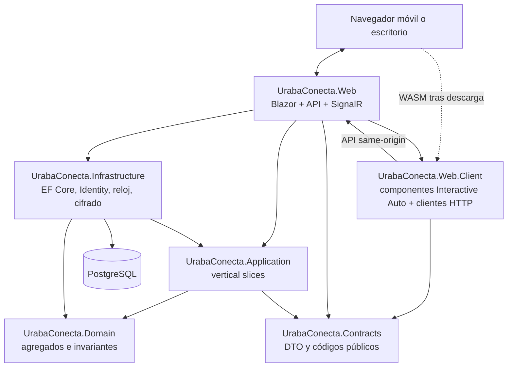
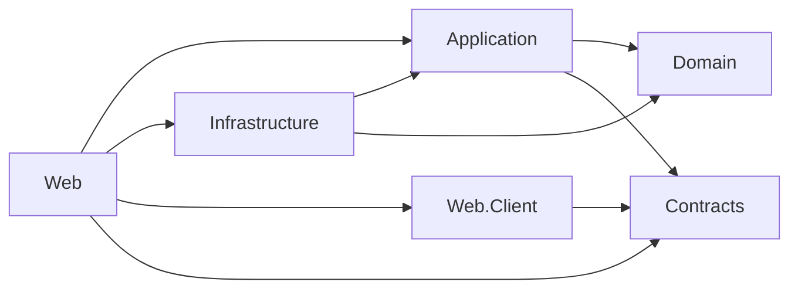
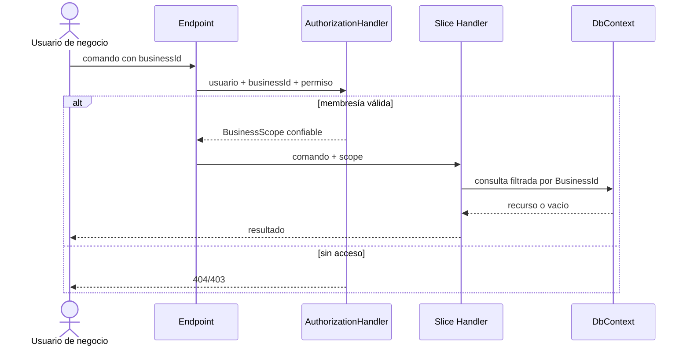
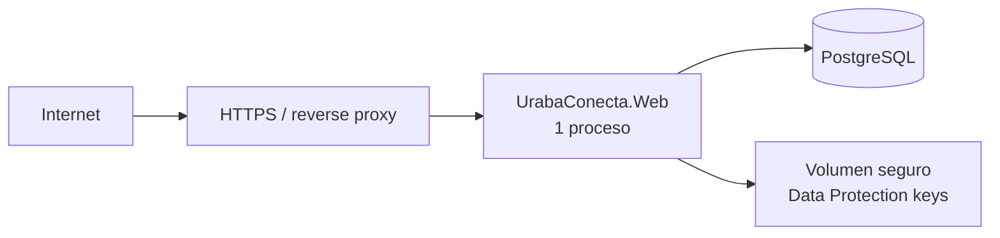

# UrabaConecta — Arquitectura

## 1. Decisión arquitectónica

UrabaConecta será un **monolito modular organizado por vertical slices**, desplegado como una sola aplicación ASP.NET Core y una sola base PostgreSQL.

No se crean microservicios, procesos auxiliares, buses externos ni bases por establecimiento.

## 2. Tecnologías obligatorias

- C# y .NET 10;
- ASP.NET Core;
- Blazor Web App;
- `InteractiveAuto` como modo interactivo;
- Entity Framework Core y Npgsql;
- PostgreSQL;
- ASP.NET Core Identity con claves `Guid`;
- SignalR para las operaciones en vivo del panel y del seguimiento;
- xUnit para pruebas;
- Playwright para E2E;
- contenedor OCI opcional para empaquetar la única aplicación.

## 3. Vista lógica



Interactive Auto puede ejecutar primero en el servidor y posteriormente en WebAssembly. Por ello:

- los componentes interactivos públicos viven en `Web.Client`;
- consumen contratos HTTP del mismo origen;
- no contienen lógica de dominio ni secretos;
- toda validación y autorización se repite en servidor;
- el resultado es un único despliegue de `UrabaConecta.Web`.

## 4. Proyectos de la solución

```text
src/
  UrabaConecta.Contracts/
  UrabaConecta.Domain/
  UrabaConecta.Application/
  UrabaConecta.Infrastructure/
  UrabaConecta.Web/
  UrabaConecta.Web.Client/
tests/
  UrabaConecta.Domain.Tests/
  UrabaConecta.IntegrationTests/
  UrabaConecta.E2ETests/
```

### Responsabilidades

| Proyecto | Contenido |
|---|---|
| `Contracts` | DTO públicos, paginación, códigos de error y contratos SignalR; sin lógica |
| `Domain` | agregados, entidades, value objects, estados, invariantes y eventos internos |
| `Application` | comandos, consultas, DTO, validadores, puertos y políticas de autorización por caso de uso |
| `Infrastructure` | `DbContext`, mapeos, migraciones, Identity, repositorios, cifrado, reloj y auditoría |
| `Web` | host, composición, endpoints, páginas SSR, autenticación, autorización, hubs y manejo de errores |
| `Web.Client` | componentes Interactive Auto, estado de formulario y clientes tipados de API |
| `Domain.Tests` | invariantes y transiciones sin infraestructura |
| `IntegrationTests` | PostgreSQL real efímero, API, Identity, autorización, concurrencia y aislamiento |
| `E2ETests` | navegador y los tres flujos completos |

## 5. Módulos

```text
Platform
Businesses
Directory
Scheduling
Queueing
Ordering
Privacy
```

- `Platform`: municipios, categorías, administración y estado de negocios.
- `Businesses`: perfil, membresías, trabajadores, permisos, horario y módulos.
- `Directory`: proyección pública de negocios y catálogos.
- `Scheduling`: servicios, disponibilidad y citas.
- `Queueing`: configuración, días de cola y turnos.
- `Ordering`: productos, franjas y pedidos.
- `Privacy`: consentimiento, supresión y retención.

Cada proyecto organiza carpetas primero por módulo y luego por slice:

```text
Scheduling/
  CreateAppointment/
    Command.cs
    Validator.cs
    Handler.cs
    Endpoint.cs            # solo en Web
  GetAvailableSlots/
  ChangeAppointmentStatus/
```

No existe una capa genérica de “services” con lógica de todos los módulos.

## 6. Dependencias permitidas



Reglas:

1. `Contracts` y `Domain` no referencian ningún otro proyecto.
2. `Application` no referencia EF Core, ASP.NET Core ni Npgsql.
3. `Infrastructure` implementa puertos de `Application`.
4. `Web` no contiene reglas de negocio.
5. `Web.Client` solo referencia `Contracts`; nunca `Web`, `Domain`, `Application` o `Infrastructure`.
6. `Web` referencia `Web.Client` para descubrir los componentes Interactive Auto del ensamblado cliente.
7. Un módulo no modifica tablas de otro mediante acceso directo; usa un contrato de aplicación.
8. Los eventos internos son síncronos y dentro del mismo proceso/transacción, salvo efectos posteriores explícitos.

## 7. Persistencia y transacciones

- Un `UrabaConectaDbContext` y una base PostgreSQL.
- Esquema lógico único `public` para el MVP; tablas con prefijos por módulo.
- Migraciones en `Infrastructure`.
- `DateTimeOffset`/`timestamptz` para instantes; `date` y `time` para reglas locales.
- Dinero como `numeric(12,2)` y código de moneda `COP`.
- `xmin` o columna `Version` como token de concurrencia donde hay comandos simultáneos.
- Una transacción por comando.
- Consultas públicas con `AsNoTracking`.
- No usar `EnsureCreated`; siempre migraciones.

### Restricciones críticas en base de datos

- índices únicos por `BusinessId` y clave natural;
- exclusión PostgreSQL para solapamientos activos de citas por trabajador;
- secuencia de turno protegida por fila `QueueDay` y concurrencia;
- capacidad de franja de recogida protegida por `pg_advisory_xact_lock` transaccional derivado de `BusinessId + inicio de franja`, seguida de recuento y creación;
- instantáneas de pedido independientes del producto;
- `CHECK` para cantidades, precios y rangos horarios;
- claves foráneas que incluyen `BusinessId` cuando sea necesario para evitar relaciones cruzadas.

## 8. Autenticación

- ASP.NET Core Identity con cookie segura, `HttpOnly`, `Secure` en producción y `SameSite=Lax`.
- Inicio de sesión solo para personal y administradores.
- No hay registro público de propietarios.
- El administrador de plataforma crea/asigna al primer propietario.
- El propietario invita o crea trabajadores mediante flujo interno; para la demo puede establecer contraseña temporal que obliga cambio.
- Bloqueo por intentos fallidos y requisitos de contraseña de Identity.
- Recuperación de contraseña puede documentarse pero, sin proveedor de correo, la demo usa restablecimiento administrativo; no simula correos.
- Clientes invitados se identifican únicamente con código de seguimiento, no con sesión.

## 9. Autorización

### Políticas

- `PlatformAdmin`: rol Identity de plataforma.
- `BusinessMember`: membresía activa para el `BusinessId` solicitado.
- `BusinessOwner`: membresía activa con rol `Owner`.
- permisos de trabajador:
  - `Appointments.Manage`;
  - `Queue.Manage`;
  - `Orders.Manage`;
  - `Catalog.Manage`;
  - `BusinessProfile.Manage`;
  - `Workers.Manage`.

### Control por recurso

1. Las rutas privadas contienen `businessId`.
2. Un filtro/handler resuelve usuario, membresía y permisos.
3. El comando recibe un `BusinessScope` confiable creado en servidor, no el valor del formulario.
4. Toda consulta incluye `BusinessId`.
5. Las entidades nuevas reciben `BusinessId` desde `BusinessScope`.
6. Un identificador de recurso ajeno responde `404` para evitar revelar existencia.
7. Falta de permiso dentro de un negocio conocido responde `403`.
8. Las operaciones de plataforma usan endpoints y handlers distintos.

### Defensa en profundidad

- filtro global EF para entidades `IBusinessOwned`;
- repositorios de negocio exigen `BusinessId`;
- claves e índices compuestos;
- revisión de cambios antes de `SaveChanges` que rechaza entidades con otro `BusinessId`;
- pruebas negativas obligatorias.

No se usa `IgnoreQueryFilters()` fuera de implementaciones de administración de plataforma claramente nombradas y auditadas.



## 10. Aislamiento entre negocios

Toda entidad de negocio implementa:

```text
BusinessId: Guid, requerido e inmutable
```

Excepciones globales: `Municipality`, `Category`, `PlatformUser`, `ConsentNoticeVersion` y tablas técnicas.

Controles obligatorios:

- no aceptar `BusinessId` dentro de payload público;
- no derivarlo de un campo oculto;
- verificar relación entre padre e hijo con claves compuestas;
- consultas públicas parten del slug y recuperan el `BusinessId` internamente;
- un usuario con membresías múltiples selecciona contexto, pero cada operación reautoriza;
- caché, cuando exista, incluye `BusinessId` en clave; no se implementa caché distribuida en MVP;
- archivos o imágenes futuros deben usar ruta por `BusinessId`; el MVP puede usar URL pública validada o activos ficticios.

## 11. Tiempo real

Dos concentradores, no uno por función.

`QueueHub` en `/hubs/queue` conserva el vocabulario de la fila —jornada, turno, llamado— y no se
tocó. `OperationsHub` en `/hubs/operations` cubre lo demás: pedidos, citas y la bandeja de avisos.

- Grupos del negocio: `ops:{businessId:N}:{canal}`, con canal en `appointments`, `orders` o
  `notifications`. Unirse exige membresía activa Y el permiso del canal, comprobado por
  `IRealtimeAccessGuard`: un grupo es una autorización, porque saber *cuándo* entra un pedido en un
  negocio ajeno ya es saber algo.
- Grupos del cliente: `track:{tipo}:{entidad:N}`, a los que se llega presentando el mismo código de
  seguimiento con el que ya consulta su estado. No hace falta cuenta.
- **Lo que viaja es una señal, nunca datos.** Quien la recibe vuelve a pedir el estado por la API,
  que es donde vive la autorización. Un mensaje mal dirigido no puede filtrar contenido.
- HTTP sigue siendo la fuente de verdad. Al conectar o reconectar, el cliente ejecuta `GET`.
- Si SignalR falla, todo sigue funcionando: sólo se pierde inmediatez.

## 11 bis. Avisos: el hecho primero, la entrega después

Web Push dejó de ser el aviso para volver a ser un canal de entrega.

```
hecho de negocio
   -> Notification            (fila durable: la bandeja)
   -> señal SignalR           (acelerador)
   -> NotificationDelivery    (una por dispositivo: el buzón)
        -> trabajador de fondo, reintentos con espera creciente, diagnóstico
```

- `INotificationPublisher` guarda el hecho y no habla con nadie de fuera: **ninguna operación de
  negocio puede caerse porque el proveedor Push esté caído**.
- La clave de deduplicación es única en la base, así que un doble clic produce un solo aviso.
- El trabajador reparte y entrega. Reclama lotes con `FOR UPDATE SKIP LOCKED`, así que dos
  instancias no envían lo mismo dos veces.
- **404 y 410 retiran la suscripción**; cualquier otro fallo se reintenta —0 s, 30 s, 2 min, 10 min,
  30 min, 2 h— y nunca cuesta el dispositivo. Antes bastaban tres errores del proveedor para dejar a
  una persona sin avisos sin que nadie se enterara.
- La bandeja del negocio y las novedades del seguimiento leen esas filas, así que el aviso se ve
  aunque no se haya entregado nunca.

## 11 ter. Capacidades

`BusinessModuleKind` tiene seis valores. `Appointments`, `VirtualQueues` y `PickupOrders` son las
operaciones que el negocio abre al público; `Services`, `Products` y `Staff` son el material que
esas operaciones consumen y se derivan de ellas mientras nadie las fije a mano
(`BusinessCapabilities`).

La categoría propone una combinación al dar de alta y sirve para encontrar el negocio. No decide
funciones: eso habría convertido cada vertical nueva en un condicional más.

## 12. Contratos y API

- endpoints versionados bajo `/api/v1`;
- DTO separados del modelo EF;
- respuestas de error `ProblemDetails`;
- validación de servidor con códigos estables;
- `ETag` o versión en comandos sensibles cuando corresponda;
- paginación por cursor o página limitada;
- OpenAPI habilitado en desarrollo y protegido/deshabilitado según configuración en producción.

Blazor consume los mismos contratos que podría usar un cliente móvil futuro.

## 13. Manejo de errores

- middleware global convierte excepciones conocidas a `ProblemDetails`;
- `400` validación sintáctica;
- `401` sin autenticación;
- `403` autenticado sin permiso;
- `404` recurso inexistente o ajeno;
- `409` concurrencia, transición o franja;
- `429` límite de intentos;
- `500` identificador de correlación sin detalle interno.

Excepciones de dominio no se muestran directamente. Los mensajes públicos provienen de un catálogo controlado.

## 14. Logging y auditoría

- `ILogger` estructurado;
- `TraceId`, `UserId` cuando exista, `BusinessId`, nombre de slice, resultado y duración;
- nunca registrar nombre, teléfono, código público, observaciones o payload completo;
- tabla `audit_entries` para:
  - cambios de estado;
  - configuración;
  - membresías y permisos;
  - accesos transversales de plataforma;
  - solicitudes de supresión.
- retención de logs definida por infraestructura de despliegue; para piloto, 30 días y acceso restringido.

## 15. Configuración y secretos

Configuración:

- `ConnectionStrings:Main`;
- `PublicTracking:HmacKey`;
- `DataProtection:KeyPath`;
- `RateLimiting:*`;
- `Privacy:RetentionDays`;
- `SeedDemoData`;
- `ASPNETCORE_ENVIRONMENT`.

Reglas:

- secretos mediante variables de entorno o almacén del entorno;
- nunca en `appsettings*.json` versionado;
- validación de opciones al inicio;
- claves de Data Protection persistentes fuera del contenedor y con acceso restringido;
- HMAC y claves de cifrado rotables mediante versión.

## 16. Datos personales

- teléfono cifrado en aplicación antes de persistir;
- código público: 16 bytes aleatorios codificados Base64URL; se almacena solo HMAC-SHA256;
- respuesta de seguimiento no incluye teléfono completo;
- rate limit por IP y endpoint; la IP no se persiste en el dominio;
- las páginas de seguimiento envían `Referrer-Policy: no-referrer` y no cargan recursos de terceros;
- supresión borra o anonimiza alias, teléfono y observaciones según política;
- ningún dato sensible permitido.

La política legal definitiva, textos de consentimiento, base jurídica, responsables y canales de derechos requieren revisión antes de usar datos reales.

La retención se ejecuta mediante un `BackgroundService` dentro de la misma aplicación, una vez al día, con bloqueo asesor PostgreSQL e implementación idempotente. No usa cola ni proceso desplegable adicional.

## 17. Despliegue

Una unidad desplegable:



Requisitos:

- Linux x64 o contenedor;
- HTTPS obligatorio;
- PostgreSQL compatible con extensión `btree_gist` para restricción de citas;
- migración ejecutada como paso controlado antes de iniciar la nueva versión;
- health checks de proceso y base;
- copias de seguridad de base verificadas;
- sin almacenamiento local efímero para claves.

No se crea infraestructura cloud en esta fase.

## 18. Estrategia de evolución

### Aplicación móvil

Reutiliza `/api/v1`; no accede a base ni a componentes internos.

### WhatsApp y otros canales

El procesamiento durable ya existe: `Notification` guarda el hecho y `NotificationDelivery` cada
intento hacia un destino. Un canal nuevo entra como otro tipo de destino del mismo buzón, con sus
reintentos y su diagnóstico; no como otro camino que envíe por su cuenta.

### Pagos

Nuevo módulo `Payments` que referencia identificadores públicos de pedidos, sin introducir estado de pago en el núcleo actual hasta definir proveedor y conciliación.

### Entregas

Nuevo módulo separado de `Ordering`; el pedido actual sigue siendo “recoger”.

### Suscripciones

Nuevo módulo de plataforma para planes y capacidades; no contaminar agregados operativos.

### Nuevos municipios

Datos de `Municipality`; no requieren código.

### Escalado

Primero escalar verticalmente el monolito y optimizar consultas. Solo se considera separar un módulo con evidencia de carga, equipo y frontera transaccional; no por anticipación.

## 19. Decisiones que no debe reinterpretar el agente de implementación

1. Un monolito, una aplicación y una base.
2. Tres agregados operativos distintos: cita, turno y pedido.
3. `BusinessId` obligatorio y autorización por recurso.
4. Código público aleatorio con hash almacenado.
5. Tiempo real como acelerador, nunca como fuente de verdad: la API manda.
6. Pedido sin pago y con precios históricos.
7. Primera vertical funcional: cita completa.
