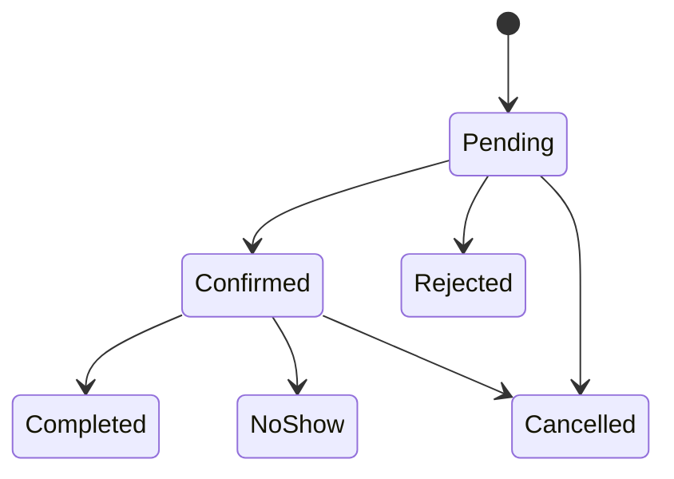

# UrabaConecta — Modelo de dominio

## 1. Principios

- Las citas, turnos y pedidos son agregados distintos.
- Ninguna entidad “Operation”, “Request” o “Workflow” representa simultáneamente los tres flujos.
- Todo dato perteneciente a un negocio incluye `BusinessId`.
- Los estados cambian mediante métodos de dominio, no asignación pública.
- Los identificadores internos son `Guid`.
- Los códigos públicos son secretos de seguimiento y no identificadores internos.
- Los instantes se almacenan en UTC; las reglas de agenda y cola usan zona horaria del negocio.

## 2. Contexto compartido

### Business — raíz de agregado

Campos principales:

- `Id`;
- `Name`;
- `Slug`;
- `Description`;
- `MunicipalityId`;
- `CategoryId`;
- `AddressText`;
- `PublicPhone`;
- `TimeZoneId`;
- `CurrencyCode`;
- `Status`: `Draft | Active | Suspended`;
- `IsPublished`;
- `CreatedAtUtc`, `UpdatedAtUtc`;
- `Version`.

Invariantes:

- slug global único, normalizado y no reutilizado mientras exista el negocio;
- solo `Active` puede publicarse;
- zona horaria válida;
- moneda `COP` en MVP;
- un negocio suspendido no acepta nuevas operaciones;
- cada módulo se habilita explícitamente.

### BusinessModule — entidad de Business

- `BusinessId`;
- `Module`: `Scheduling | Queueing | Ordering`;
- `IsEnabled`;
- configuración mínima específica referenciada por módulo.

No almacena configuración polimórfica en JSON.

### BusinessMembership — agregado de autorización

- `Id`, `BusinessId`, `UserId`;
- `Role`: `Owner | Worker`;
- `IsActive`;
- conjunto de `MembershipPermission`;
- fechas de creación/desactivación.

Invariantes:

- una membresía única por `BusinessId + UserId`;
- propietario tiene todos los permisos del negocio;
- solo propietario o administrador de plataforma modifica membresías;
- un propietario no puede quitar su propia última membresía de propietario.

### StaffMember — raíz de agregado operacional

Representa a quien presta servicios o atiende; puede existir sin cuenta.

- `Id`, `BusinessId`;
- `DisplayName`;
- `LinkedUserId` opcional;
- `IsActive`;
- `Version`.

Invariantes:

- `DisplayName` no vacío;
- `LinkedUserId`, si existe, debe tener membresía activa del mismo negocio;
- desactivar no borra citas históricas.

### BusinessHours — agregado

- reglas semanales por día;
- intervalos de apertura;
- excepciones por fecha;
- zona horaria tomada de Business.

Invariantes:

- inicio menor que fin;
- intervalos del mismo día no se solapan;
- una excepción reemplaza, no suma ambiguamente, la regla semanal.

## 3. Agendamiento

### Service — raíz de agregado

- `Id`, `BusinessId`;
- `Name`, `Description`;
- `DurationMinutes`;
- `DisplayPrice` opcional;
- `IsActive`;
- `Version`.

Invariantes:

- duración entre 5 y 480 minutos;
- precio, si existe, no negativo;
- un servicio inactivo no genera nuevas franjas.

### StaffService — relación

- `BusinessId`, `StaffMemberId`, `ServiceId`;
- `IsActive`.

Ambos extremos deben pertenecer al mismo negocio.

### AvailabilityRule — entidad de StaffMember

- `Id`, `BusinessId`, `StaffMemberId`;
- `DayOfWeek`, `StartLocalTime`, `EndLocalTime`;
- `ValidFrom`, `ValidTo` opcional.

### AvailabilityException

- `Id`, `BusinessId`, `StaffMemberId`;
- `LocalDate`;
- `IsUnavailable` o intervalo alternativo;
- `Reason` interno opcional.

### Appointment — raíz de agregado

- `Id`, `BusinessId`;
- `ServiceId`, `StaffMemberId`;
- `StartAtUtc`, `EndAtUtc`;
- instantáneas `ServiceName`, `DurationMinutes`, `DisplayPrice`;
- `CustomerAlias`;
- `EncryptedPhone`, `PhoneLast4`;
- `PublicCodeHash`, `PublicCodeVersion`;
- `ConsentReceiptId`;
- `Status`;
- `RejectionReason` opcional;
- `CreatedAtUtc`, `UpdatedAtUtc`;
- `Version`.

Estados:

Invariantes:

- inicio futuro al crear;
- fin = inicio + duración copiada;
- servicio y trabajador pertenecen al mismo negocio;
- trabajador presta el servicio y está disponible;
- alias y teléfono requeridos;
- consentimiento requerido;
- `Pending` y `Confirmed` no se solapan para el mismo trabajador;
- transición válida según estado;
- una terminal no cambia;
- no se cambia servicio, trabajador o tiempo después de crear en MVP.

Eventos internos:

- `AppointmentRequested`;
- `AppointmentStatusChanged`;
- `AppointmentCancelled`;
- `PersonalDataRedacted`.

Los eventos actualizan auditoría y proyecciones en el mismo proceso. No implican mensajería externa.

## 4. Turnos

### QueueSettings — raíz de agregado

- `BusinessId`;
- `IsEnabled`;
- `EstimatedMinutesPerTicket`;
- `MaxActiveTickets`;
- `Version`.

### QueueDay — raíz de agregado

- `Id`, `BusinessId`;
- `LocalDate`;
- `Status`: `Closed | Open`;
- `NextNumber`;
- `OpenedAtUtc`, `ClosedAtUtc`;
- `Version`.

Invariantes:

- uno por negocio y fecha local;
- solo una cola abierta por negocio;
- `NextNumber` aumenta de uno en uno y nunca retrocede;
- cerrar impide nuevos turnos, pero no elimina activos.

### QueueTicket — raíz de agregado

- `Id`, `BusinessId`, `QueueDayId`;
- `Number`;
- `PublicCodeHash`, `PublicCodeVersion`;
- `Status`;
- `CalledAtUtc`, `CompletedAtUtc`;
- `RestoreCount`;
- `CreatedAtUtc`, `Version`.

Estados:

`Waiting | Called | Completed | Skipped | Cancelled`

Invariantes:

- número único por `BusinessId + LocalDate`;
- no requiere alias ni teléfono;
- siguiente = `Waiting` más antiguo por número;
- solo `Called` pasa a `Completed` o `Skipped`;
- `Skipped` vuelve a `Waiting` máximo una vez;
- terminales: `Completed`, `Cancelled`;
- el estado público nunca expone otros códigos.

Eventos internos:

- `QueueOpened`;
- `TicketIssued`;
- `TicketCalled`;
- `TicketStateChanged`;
- `QueueClosed`.

Estos eventos se publican a `QueueHub` después de confirmar la transacción.

## 5. Pedidos

### ProductCategory — raíz de agregado

- `Id`, `BusinessId`;
- `Name`, `SortOrder`, `IsActive`.

### Product — raíz de agregado

- `Id`, `BusinessId`, `ProductCategoryId`;
- `Name`, `Description`;
- `CurrentPrice`;
- `IsAvailable`, `IsActive`;
- `Version`.

Invariantes:

- precio no negativo;
- categoría del mismo negocio;
- inactivo o no disponible impide nuevas líneas;
- edición no afecta instantáneas históricas.

### PickupSettings — raíz de agregado

- `BusinessId`;
- `SlotMinutes`;
- `MaxOrdersPerSlot`;
- `MinimumLeadMinutes`;
- `HorizonDays`;
- `Version`.

### PickupException

- `BusinessId`, `LocalDate`;
- intervalos habilitados o día cerrado.

### PickupOrder — raíz de agregado

- `Id`, `BusinessId`;
- `CustomerAlias`;
- `EncryptedPhone`, `PhoneLast4`;
- `RequestedPickupStartUtc`, `RequestedPickupEndUtc`;
- `ProposedPickupStartUtc`, `ProposedPickupEndUtc` opcionales;
- `AdjustmentMessage` opcional;
- `CustomerNotes` opcionales;
- `PublicCodeHash`, `PublicCodeVersion`;
- `ConsentReceiptId`;
- `Status`;
- `TotalAmount`, `CurrencyCode`;
- colección `PickupOrderItem`;
- `CancellationReason` opcional;
- tiempos de estado;
- `Version`.

### PickupOrderItem — entidad interna

- `Id`, `BusinessId`, `PickupOrderId`;
- `ProductId` opcional para referencia;
- `ProductNameSnapshot`;
- `UnitPriceSnapshot`;
- `Quantity`;
- `LineTotal`.

Estados:

`Submitted | AdjustmentRequested | Accepted | Rejected | Preparing | Ready | Delivered | Cancelled`

Invariantes:

- al menos una línea;
- cantidad por línea entre 1 y 20;
- máximo 30 líneas;
- total calculado en servidor;
- `LineTotal = UnitPriceSnapshot × Quantity`;
- `TotalAmount = suma de LineTotal`;
- moneda `COP`;
- alias, teléfono y consentimiento requeridos;
- franja dentro de configuración y capacidad;
- un ajuste requiere mensaje y/o nueva franja;
- cliente solo acepta ajuste o cancela;
- negocio no marca preparación antes de aceptar;
- `Delivered`, `Rejected` y `Cancelled` son terminales;
- no existe estado de pago.

Eventos internos:

- `PickupOrderSubmitted`;
- `PickupOrderAdjustmentRequested`;
- `PickupOrderStatusChanged`;
- `PickupOrderCancelled`;
- `PersonalDataRedacted`.

## 6. Privacidad

### ConsentNoticeVersion — dato global

- `Id`;
- `FlowType`: `Appointment | PickupOrder`;
- `Version`;
- `ShortText`;
- `FullTextUrl` o referencia;
- `EffectiveFromUtc`;
- `IsActive`.

El texto requiere revisión jurídica antes del piloto real.

### ConsentReceipt

- `Id`;
- `BusinessId`;
- `FlowType`;
- `ConsentNoticeVersionId`;
- `AcceptedAtUtc`;
- `SubjectReferenceId`;
- `Source`: `PublicWeb`;

No almacena IP, agente de usuario, documento de identidad ni firma.

### DeletionRequest

- `Id`;
- `BusinessId` opcional;
- `RequestType`;
- `SubjectReferenceHash`;
- `Status`;
- `RequestedAtUtc`, `CompletedAtUtc`;
- `HandledByUserId`;
- notas internas sin reproducir PII.

## 7. Catálogos globales

### Municipality

- `Id`, `Name`, `Slug`, `IsActive`, `SortOrder`.

Datos iniciales: Apartadó, Carepa, Chigorodó y Turbo.

### Category

- `Id`, `Name`, `Slug`, `IsActive`, `SortOrder`.

No pertenecen a un negocio y solo plataforma los modifica.

## 8. Datos compartidos y específicos

| Compartido | Citas | Turnos | Pedidos |
|---|---|---|---|
| Business | Service | QueueSettings | ProductCategory |
| Membership | StaffService | QueueDay | Product |
| StaffMember | AvailabilityRule | QueueTicket | PickupSettings |
| BusinessHours | Appointment |  | PickupOrder |
| ConsentNoticeVersion |  |  | PickupOrderItem |
| AuditEntry |  |  |  |

Se comparte infraestructura y conceptos estables, no una superentidad operacional.

## 9. Servicios de dominio

Solo cuando una regla no pertenece naturalmente a una raíz:

- `AppointmentSlotCalculator`;
- `EligibleStaffSelector`;
- `OrderPricingService`;
- `PublicCodeGenerator` como puerto criptográfico;
- `BusinessLocalClock`.

No se crea un `GenericWorkflowService`.

## 10. Retención y supresión

Política técnica inicial para piloto, pendiente de revisión jurídica:

- alias, teléfono y observaciones de cita/pedido: suprimir 90 días después de estado terminal;
- código público: invalidar al suprimir datos personales;
- datos operativos anonimizados: conservar hasta 12 meses para métricas y luego eliminar;
- turnos anónimos: eliminar 30 días después del cierre de la cola;
- consentimientos: conservar junto con el dato personal y suprimir según instrucción jurídica;
- usuarios de negocio: conservar mientras exista relación; desactivar antes de eliminar;
- auditoría: 12 meses, sin PII.

La supresión conserva totales y estados solo si ya no pueden asociarse con una persona.

