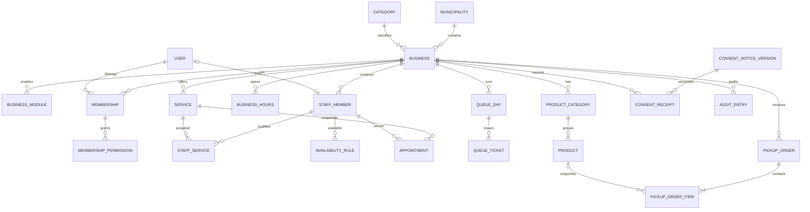

# UrabaConecta — Modelo de datos

## 1. Convenciones

- PostgreSQL 16 o versión soportada por el entorno.
- Nombres `snake_case`.
- Claves internas `uuid`.
- Instantes `timestamptz`.
- Fechas y horas locales `date` y `time`.
- Dinero `numeric(12,2)`.
- Texto corto `varchar(n)` con límites explícitos.
- Estados como `varchar(32)` con `CHECK`; no enums PostgreSQL en MVP para facilitar migraciones.
- Toda tabla de negocio contiene `business_id uuid NOT NULL`.
- Toda tabla padre referenciada por una entidad de negocio declara clave alternativa `UNIQUE(business_id, id)` para permitir FK compuesta.
- Toda tabla mutable relevante contiene `version bigint NOT NULL DEFAULT 0` o usa `xmin` como token EF.
- Borrado físico solo por retención/supresión; estados operativos no se representan borrando filas.

## 2. Tablas globales e identidad

### `identity_users`

Tablas estándar de ASP.NET Core Identity adaptadas a `Guid`.

Columnas relevantes:

- `id uuid PK`;
- `user_name`, `normalized_user_name`;
- `email`, `normalized_email`;
- `password_hash`;
- `security_stamp`;
- `lockout_end`, `access_failed_count`;
- `is_active boolean`.

Restricciones/índices:

- únicos de Identity sobre nombres y correos normalizados;
- no almacenar documento de identidad.

### `platform_municipalities`

- `id uuid PK`;
- `name varchar(80) NOT NULL`;
- `slug varchar(80) NOT NULL`;
- `is_active boolean NOT NULL`;
- `sort_order int NOT NULL`.

Índices: `UNIQUE(slug)`.

### `platform_categories`

Misma forma que municipios. Índice `UNIQUE(slug)`.

### `privacy_consent_notice_versions`

- `id uuid PK`;
- `flow_type varchar(24) NOT NULL`;
- `version varchar(24) NOT NULL`;
- `short_text varchar(500) NOT NULL`;
- `full_text_url varchar(500) NULL`;
- `effective_from_utc timestamptz NOT NULL`;
- `is_active boolean NOT NULL`.

Restricciones:

- `UNIQUE(flow_type, version)`;
- máximo una versión activa por flujo mediante índice único parcial.

## 3. Negocios y autorización

### `businesses`

- `id uuid PK`;
- `name varchar(120) NOT NULL`;
- `slug varchar(120) NOT NULL`;
- `description varchar(1000) NULL`;
- `municipality_id uuid NOT NULL FK`;
- `category_id uuid NOT NULL FK`;
- `address_text varchar(240) NULL`;
- `public_phone varchar(40) NULL`;
- `time_zone_id varchar(80) NOT NULL DEFAULT 'America/Bogota'`;
- `currency_code char(3) NOT NULL DEFAULT 'COP'`;
- `status varchar(20) NOT NULL`;
- `is_published boolean NOT NULL DEFAULT false`;
- `created_at_utc`, `updated_at_utc timestamptz NOT NULL`;
- `version bigint NOT NULL`.

Restricciones:

- `UNIQUE(slug)`;
- `CHECK(currency_code = 'COP')`;
- `CHECK(status IN ('Draft','Active','Suspended'))`;
- publicación válida en dominio solo con estado activo.

### `business_modules`

- `business_id uuid NOT NULL FK`;
- `module varchar(24) NOT NULL`;
- `is_enabled boolean NOT NULL`;
- `updated_at_utc timestamptz NOT NULL`;
- `version bigint NOT NULL`;
- PK `(business_id, module)`;
- `CHECK(module IN ('Scheduling','Queueing','Ordering'))`.

### `business_memberships`

- `id uuid PK`;
- `business_id uuid NOT NULL FK`;
- `user_id uuid NOT NULL FK identity_users`;
- `role varchar(16) NOT NULL`;
- `is_active boolean NOT NULL`;
- `created_at_utc`, `deactivated_at_utc`;
- `version bigint NOT NULL`.

Índices/restricciones:

- `UNIQUE(business_id, user_id)`;
- `INDEX(user_id, is_active)`;
- `CHECK(role IN ('Owner','Worker'))`.

### `business_membership_permissions`

- `business_id uuid NOT NULL`;
- `membership_id uuid NOT NULL`;
- `permission varchar(64) NOT NULL`;
- PK `(membership_id, permission)`;
- FK compuesta `(membership_id, business_id)` hacia membresía mediante clave única correspondiente.

### `business_staff_members`

- `id uuid PK`;
- `business_id uuid NOT NULL FK`;
- `display_name varchar(100) NOT NULL`;
- `linked_user_id uuid NULL FK`;
- `is_active boolean NOT NULL`;
- `version bigint NOT NULL`.

Índices:

- `INDEX(business_id, is_active)`;
- `UNIQUE(business_id, linked_user_id)` parcial donde no sea nulo.

### `business_hours`

- `id uuid PK`;
- `business_id uuid NOT NULL FK`;
- `day_of_week smallint NOT NULL`;
- `start_local time NOT NULL`;
- `end_local time NOT NULL`;
- `version bigint NOT NULL`.

Restricciones:

- `CHECK(day_of_week BETWEEN 0 AND 6)`;
- `CHECK(start_local < end_local)`;
- exclusión o validación transaccional contra intervalos superpuestos por negocio/día.

### `business_hour_exceptions`

- `id uuid PK`;
- `business_id uuid NOT NULL FK`;
- `local_date date NOT NULL`;
- `is_closed boolean NOT NULL`;
- `start_local time NULL`;
- `end_local time NULL`;
- `reason varchar(160) NULL`;
- `version bigint NOT NULL`.

Restricciones:

- `UNIQUE(business_id, local_date)`;
- si `is_closed`, horas nulas; si no, ambas requeridas y ordenadas.

## 4. Agendamiento

### `scheduling_services`

- `id uuid PK`;
- `business_id uuid NOT NULL FK`;
- `name varchar(120) NOT NULL`;
- `description varchar(500) NULL`;
- `duration_minutes smallint NOT NULL`;
- `display_price numeric(12,2) NULL`;
- `is_active boolean NOT NULL`;
- `version bigint NOT NULL`.

Restricciones/índices:

- `CHECK(duration_minutes BETWEEN 5 AND 480)`;
- `CHECK(display_price IS NULL OR display_price >= 0)`;
- `INDEX(business_id, is_active)`;
- `UNIQUE(business_id, id)` para FKs compuestas.

### `scheduling_staff_services`

- `business_id uuid NOT NULL`;
- `staff_member_id uuid NOT NULL`;
- `service_id uuid NOT NULL`;
- `is_active boolean NOT NULL`;
- PK `(business_id, staff_member_id, service_id)`;
- FK compuestas garantizan mismo negocio.

### `scheduling_availability_rules`

- `id uuid PK`;
- `business_id uuid NOT NULL`;
- `staff_member_id uuid NOT NULL`;
- `day_of_week smallint NOT NULL`;
- `start_local time NOT NULL`;
- `end_local time NOT NULL`;
- `valid_from date NOT NULL`;
- `valid_to date NULL`;
- `version bigint NOT NULL`.

Índice `(business_id, staff_member_id, day_of_week, valid_from)`.

### `scheduling_availability_exceptions`

- `id uuid PK`;
- `business_id uuid NOT NULL`;
- `staff_member_id uuid NOT NULL`;
- `local_date date NOT NULL`;
- `is_unavailable boolean NOT NULL`;
- `start_local time NULL`;
- `end_local time NULL`;
- `reason varchar(160) NULL`;
- `version bigint NOT NULL`.

Índice único `(business_id, staff_member_id, local_date)`.

### `scheduling_appointments`

- `id uuid PK`;
- `business_id uuid NOT NULL`;
- `service_id uuid NOT NULL`;
- `staff_member_id uuid NOT NULL`;
- `start_at_utc timestamptz NOT NULL`;
- `end_at_utc timestamptz NOT NULL`;
- `service_name_snapshot varchar(120) NOT NULL`;
- `duration_minutes_snapshot smallint NOT NULL`;
- `display_price_snapshot numeric(12,2) NULL`;
- `customer_alias varchar(100) NULL`;
- `encrypted_phone text NULL`;
- `phone_last4 char(4) NULL`;
- `public_code_hash bytea NOT NULL`;
- `public_code_version smallint NOT NULL`;
- `consent_receipt_id uuid NULL`;
- `status varchar(24) NOT NULL`;
- `rejection_reason varchar(240) NULL`;
- `created_at_utc`, `updated_at_utc timestamptz NOT NULL`;
- `personal_data_redacted_at_utc timestamptz NULL`;
- `version bigint NOT NULL`.

Restricciones:

- `UNIQUE(public_code_hash)`;
- FKs compuestas por `business_id` a servicio y trabajador;
- `CHECK(start_at_utc < end_at_utc)`;
- estados permitidos;
- índice `(business_id, start_at_utc, status)`;
- índice `(business_id, staff_member_id, start_at_utc)`.

Prevención de doble reserva:

```sql
CREATE EXTENSION IF NOT EXISTS btree_gist;

ALTER TABLE scheduling_appointments
ADD CONSTRAINT scheduling_appointments_no_overlap
EXCLUDE USING gist (
  business_id WITH =,
  staff_member_id WITH =,
  tstzrange(start_at_utc, end_at_utc, '[)') WITH &&
)
WHERE (status IN ('Pending', 'Confirmed'));
```

La migración debe probarse en PostgreSQL real; no se confía en proveedor en memoria.

## 5. Turnos

### `queue_settings`

- `business_id uuid PK/FK`;
- `estimated_minutes_per_ticket smallint NOT NULL`;
- `max_active_tickets smallint NOT NULL`;
- `version bigint NOT NULL`.

### `queue_days`

- `id uuid PK`;
- `business_id uuid NOT NULL`;
- `local_date date NOT NULL`;
- `status varchar(16) NOT NULL`;
- `next_number int NOT NULL`;
- `opened_at_utc`, `closed_at_utc timestamptz NULL`;
- `version bigint NOT NULL`.

Restricciones:

- `UNIQUE(business_id, local_date)`;
- índice único parcial `(business_id)` donde `status='Open'`;
- `CHECK(next_number >= 1)`.

### `queue_tickets`

- `id uuid PK`;
- `business_id uuid NOT NULL`;
- `queue_day_id uuid NOT NULL`;
- `number int NOT NULL`;
- `public_code_hash bytea NOT NULL`;
- `public_code_version smallint NOT NULL`;
- `status varchar(16) NOT NULL`;
- `restore_count smallint NOT NULL DEFAULT 0`;
- `created_at_utc`, `called_at_utc`, `completed_at_utc timestamptz NULL`;
- `version bigint NOT NULL`.

Restricciones/índices:

- `UNIQUE(public_code_hash)`;
- `UNIQUE(queue_day_id, number)`;
- `INDEX(business_id, queue_day_id, status, number)`;
- FK compuesta asegura mismo `business_id`;
- `CHECK(restore_count BETWEEN 0 AND 1)`.

## 6. Pedidos

### `ordering_product_categories`

- `id uuid PK`;
- `business_id uuid NOT NULL`;
- `name varchar(100) NOT NULL`;
- `sort_order int NOT NULL`;
- `is_active boolean NOT NULL`;
- `version bigint NOT NULL`.

Índice `(business_id, is_active, sort_order)`.

### `ordering_products`

- `id uuid PK`;
- `business_id uuid NOT NULL`;
- `product_category_id uuid NOT NULL`;
- `name varchar(120) NOT NULL`;
- `description varchar(500) NULL`;
- `current_price numeric(12,2) NOT NULL`;
- `is_available boolean NOT NULL`;
- `is_active boolean NOT NULL`;
- `version bigint NOT NULL`.

Restricciones:

- `CHECK(current_price >= 0)`;
- FK compuesta con categoría del mismo negocio;
- índice `(business_id, product_category_id, is_active, is_available)`.

### `ordering_pickup_settings`

- `business_id uuid PK/FK`;
- `slot_minutes smallint NOT NULL`;
- `max_orders_per_slot smallint NOT NULL`;
- `minimum_lead_minutes smallint NOT NULL`;
- `horizon_days smallint NOT NULL`;
- `version bigint NOT NULL`.

Checks: valores positivos, horizonte máximo 60 días.

### `ordering_pickup_exceptions`

- `id uuid PK`;
- `business_id uuid NOT NULL`;
- `local_date date NOT NULL`;
- `is_closed boolean NOT NULL`;
- `start_local`, `end_local time NULL`;
- `version bigint NOT NULL`;
- `UNIQUE(business_id, local_date)`.

### `ordering_pickup_orders`

- `id uuid PK`;
- `business_id uuid NOT NULL`;
- `customer_alias varchar(100) NULL`;
- `encrypted_phone text NULL`;
- `phone_last4 char(4) NULL`;
- `requested_pickup_start_utc`, `requested_pickup_end_utc timestamptz NOT NULL`;
- `proposed_pickup_start_utc`, `proposed_pickup_end_utc timestamptz NULL`;
- `adjustment_message varchar(300) NULL`;
- `customer_notes varchar(300) NULL`;
- `public_code_hash bytea NOT NULL`;
- `public_code_version smallint NOT NULL`;
- `consent_receipt_id uuid NULL`;
- `status varchar(32) NOT NULL`;
- `total_amount numeric(12,2) NOT NULL`;
- `currency_code char(3) NOT NULL`;
- `cancellation_reason varchar(240) NULL`;
- tiempos por estado;
- `personal_data_redacted_at_utc timestamptz NULL`;
- `version bigint NOT NULL`.

Índices/restricciones:

- `UNIQUE(public_code_hash)`;
- `INDEX(business_id, status, created_at_utc DESC)`;
- `INDEX(business_id, requested_pickup_start_utc)`;
- checks de intervalo, total no negativo y `currency_code='COP'`.

La capacidad de una franja no se confía a un conteo sin bloqueo: el comando obtiene un `pg_advisory_xact_lock` calculado de `business_id + requested_pickup_start_utc`, cuenta pedidos no cancelados/rechazados de la franja y solo crea si queda capacidad.

### `ordering_pickup_order_items`

- `id uuid PK`;
- `business_id uuid NOT NULL`;
- `pickup_order_id uuid NOT NULL`;
- `product_id uuid NULL`;
- `product_name_snapshot varchar(120) NOT NULL`;
- `unit_price_snapshot numeric(12,2) NOT NULL`;
- `quantity smallint NOT NULL`;
- `line_total numeric(12,2) NOT NULL`.

Restricciones:

- FK compuesta a pedido del mismo negocio;
- `CHECK(quantity BETWEEN 1 AND 20)`;
- `CHECK(unit_price_snapshot >= 0)`;
- `CHECK(line_total = unit_price_snapshot * quantity)`.

## 7. Privacidad y auditoría

### `privacy_consent_receipts`

- `id uuid PK`;
- `business_id uuid NOT NULL`;
- `flow_type varchar(24) NOT NULL`;
- `consent_notice_version_id uuid NOT NULL`;
- `subject_reference_id uuid NOT NULL`;
- `source varchar(24) NOT NULL`;
- `accepted_at_utc timestamptz NOT NULL`.

Índice `(business_id, subject_reference_id)`.

### `privacy_deletion_requests`

- `id uuid PK`;
- `business_id uuid NULL`;
- `request_type varchar(32) NOT NULL`;
- `subject_reference_hash bytea NOT NULL`;
- `status varchar(24) NOT NULL`;
- `requested_at_utc`, `completed_at_utc timestamptz NULL`;
- `handled_by_user_id uuid NULL`;
- `internal_notes varchar(500) NULL`.

### `audit_entries`

- `id uuid PK`;
- `business_id uuid NULL`;
- `actor_user_id uuid NULL`;
- `action varchar(100) NOT NULL`;
- `entity_type varchar(80) NOT NULL`;
- `entity_id uuid NULL`;
- `occurred_at_utc timestamptz NOT NULL`;
- `trace_id varchar(64) NULL`;
- `metadata jsonb NOT NULL DEFAULT '{}'`.

`metadata` usa lista blanca y nunca contiene alias, teléfono, códigos ni observaciones.

Índice `(business_id, occurred_at_utc DESC)`.

## 8. Diagrama entidad-relación



## 9. Migraciones

1. Crear migraciones pequeñas por vertical.
2. Revisar SQL generado antes de aplicar.
3. Probar migración desde base vacía y desde versión anterior.
4. Aplicar extensión `btree_gist` y exclusión de citas mediante SQL de migración.
5. No editar una migración ya aplicada en entorno compartido; crear correctiva.
6. Semillas globales usan IDs estables.
7. Datos demo se cargan con inicializador idempotente separado de migraciones.
8. El despliegue ejecuta migración una vez antes de levantar la nueva versión.
9. Cambios destructivos usan expandir/migrar/contraer y respaldo previo.

## 10. Aislamiento por `BusinessId`

Para cada tabla de negocio:

- columna no nula;
- índice que inicia con `business_id` en rutas frecuentes;
- relación padre-hijo con `business_id` incluido;
- filtro global EF;
- creación desde contexto autorizado;
- validación previa a guardar;
- pruebas de lectura, actualización, eliminación y asociación cruzadas.

Una simple cláusula global no es suficiente; los cinco controles se aplican conjuntamente.

## 11. Información que no debe almacenarse

- documentos de identidad;
- fecha de nacimiento;
- historia clínica o motivos médicos;
- datos biométricos;
- números de tarjeta, cuenta o comprobantes bancarios;
- contraseñas fuera de Identity;
- contenido de WhatsApp o redes sociales;
- ubicación GPS;
- contactos del teléfono;
- IP en entidades de dominio;
- códigos públicos en texto plano;
- teléfonos sin cifrar;
- payloads completos en logs;
- información de entrega a domicilio;
- datos de menores identificados;
- notas libres sin límite.
